# JSAT architecture

This document explains how JSAT 0.4.14 is assembled and how requests move through it. It is
based on the code and a refreshed self-index on 2026-09-01, not only on the public feature
description.

## Verified snapshot

| Measure | Current value |
|---|---:|
| Python modules under `jsat/` | 90 |
| Python source lines under `jsat/` | 26,914 |
| Top-level CLI commands | 33 |
| MCP tools | 69 |
| Shipped slash-command documents | 47 |
| Self-index graph | 1,950 nodes / 9,004 edges |
| Graph nodes | 1,635 functions, 185 classes, 122 files, 8 knowledge nodes |
| CI-safe pytest run | 611 passed / 9 skipped / 34 deselected |

The current repository is a **layered modular monolith**. The CLI, SDK, shell, and MCP server
are adapters around one `JSAT` facade. The facade lazily selects graph and AI adapters, while
feature logic lives in `jsat/tools/`. The persistent graph is the product's shared source of
codebase context.

## 1. System context

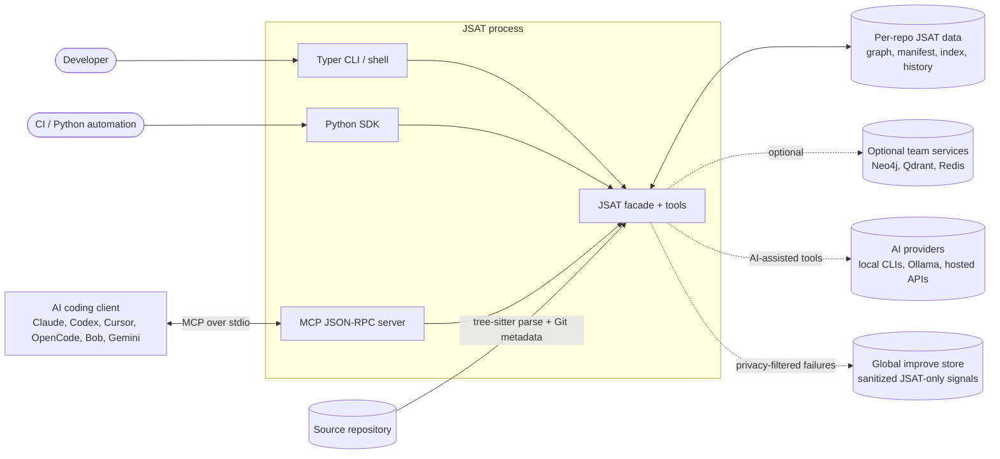

The AI coding client and the AI provider are separate roles. A client may call JSAT through MCP,
while an AI-assisted JSAT tool can independently use a configured provider. Launch routing in
`_ai/routing.py` prevents one client's model selection from leaking into another provider.

## 2. Runtime layers and ownership

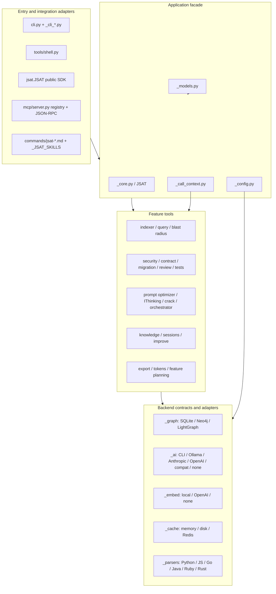

The intended dependency direction is inward-to-outward through the facade: adapters parse or
serialize requests, `JSAT` selects dependencies, and tools contain the use cases. Heavy imports
are deliberately inside functions so `jsat --help` and `JSAT()` remain fast and optional extras
fail only when invoked.

### Module responsibilities

| Area | Responsibility | Important boundary |
|---|---|---|
| `cli.py`, `_cli_*.py` | Typer commands, argument validation, Rich presentation, launch/connect workflows | Presentation only; imports tool logic lazily |
| `_core.py` | Stable SDK facade, config/path pinning, lazy graph and AI creation | Shared route used by CLI and SDK |
| `mcp/server.py` | 69-tool registry, JSON-RPC, RBAC, budgets, progress, dashboard and metrics | MCP schemas and handlers; not `mcp/tools.py` |
| `tools/` | Indexing and every analysis/reasoning use case | Real feature implementation |
| `_parsers/` | Tree-sitter extraction into normalized nodes and edges | One parser instance per worker/file |
| `_graph/` | `GraphClient` contract and storage adapters | SQLite is the solo default; Neo4j is optional team storage |
| `_ai/` | Provider contract, aliases, launch routing and adapters | `NoOpProvider` is the degradation boundary |
| `_config.py`, `_models.py` | Detection, presets, merge/defaults and validation | All config fields default for backward compatibility |
| `_improve/` | Capture, sanitization, clustering and safe persistence | JSAT-internal data only; drop rather than redact |
| `commands/`, `_cli_skills_data.py` | Agent instructions for supported clients | Parallel registries that must remain synchronized |

## 3. Indexing pipeline

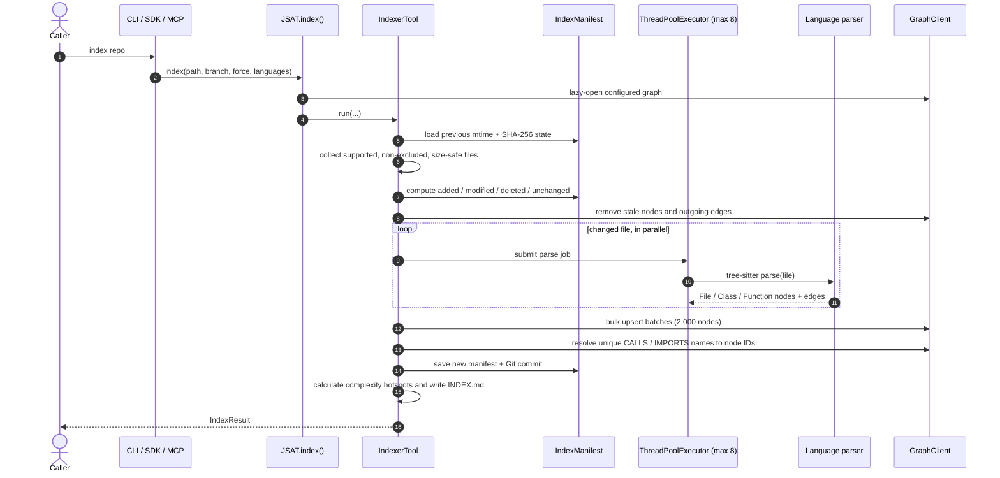

Indexing is incremental unless forced. Files are filtered using configured languages, exclude
patterns, maximum size, and symlink policy. Parsing failures are isolated per file and return an
empty result for that file rather than aborting the full index.

### Parser output model

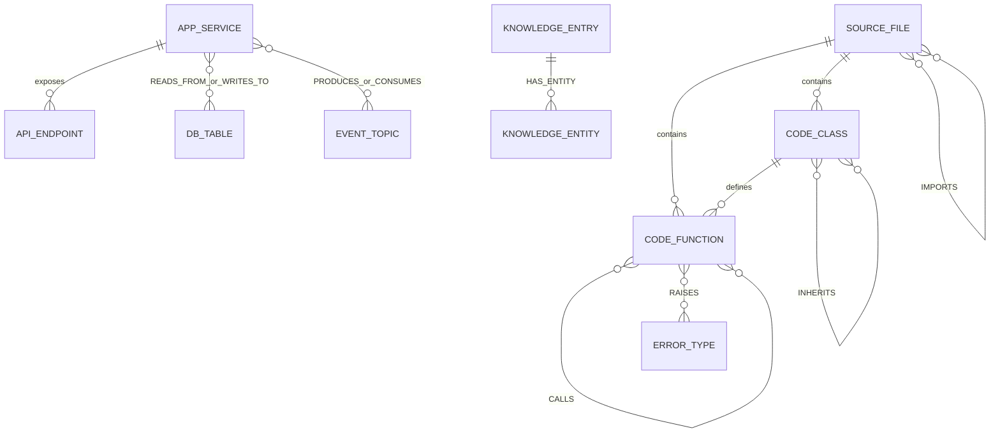

The storage schema is deliberately generic: `nodes(id, label, properties JSON)` and
`edges(id, type, source_id, target_id, properties JSON)`. The richer diagram above is a logical
schema imposed by labels, edge types, and JSON properties, not separate SQL tables.

The refreshed self-index currently contains mostly code topology:

- 7,831 `CALLS`, 936 `IMPORTS`, 116 `RAISES`, and 110 `INHERITS` edges.
- Eight knowledge nodes add `HAS_ENTITY`, `USES`, `DEPENDS_ON`, and `DOCUMENTS` relationships.
- No `Service`, `Endpoint`, `Table`, or `Topic` nodes exist in this Python-only repository, but
  the query and MCP surfaces understand those labels for indexed application repositories.

## 4. Request execution paths

### Direct CLI or SDK call

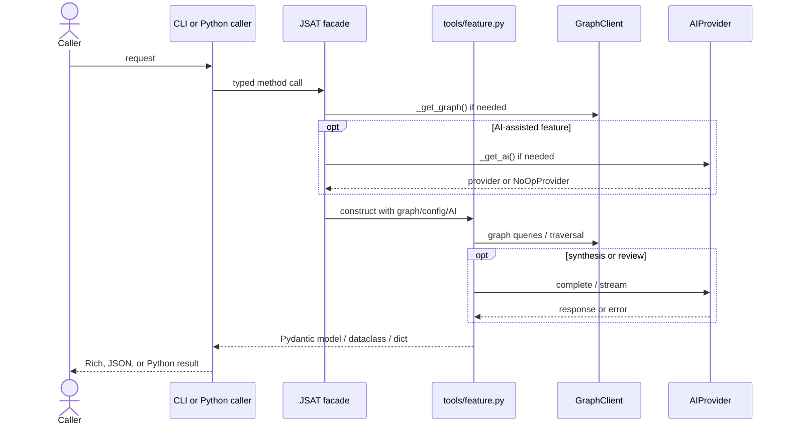

### MCP tool call

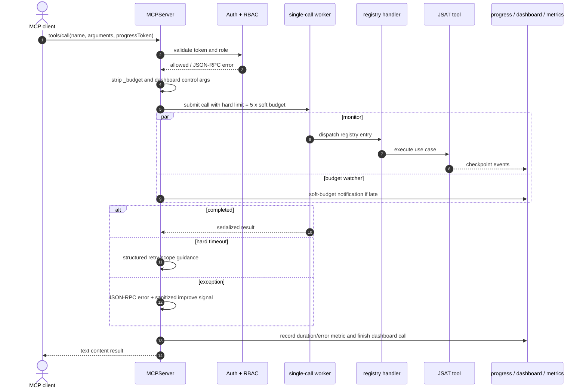

MCP has three authorization levels. `viewer` can use 17 read-only tools; `developer` can use 43
listed tools including impact, assurance, knowledge writes, and IThinking; `admin` is
unrestricted. With no auth environment variables, local stdio access is intentionally open and
emits a warning unless explicitly acknowledged.

Nested calls have depth-sensitive sub-budgets (120, 30, 15, 8, 4, 2, 1 seconds) and are rejected
at depth seven. A soft timeout reports progress but does not cancel work; the worker future gets a
hard timeout at five times the selected soft budget.

## 5. How the major feature families work

| Family | Main algorithm | AI required? |
|---|---|---|
| Index | Incremental manifest, parallel tree-sitter parse, bulk upsert, symbol resolution | No |
| Query | Extract question keywords, select graph context, build grounded prompt, synthesize | Yes for answer; graph context still builds without it |
| Blast radius | Resolve a file/symbol, breadth-first graph traversal, classify by final edge type | No |
| Security | Semgrep when installed, secret entropy/pattern checks, graph-based auth/data-flow checks | No for core scan |
| Incident | Read recent Git commits, score recency/relevance/scope, optionally synthesize hypotheses | Optional |
| Contract/migration | Compare specs or parse SQL operations and classify breaking/locking risk | No for structural result |
| Review | Run configured providers, parse findings, deduplicate and rank multi-model agreement | Yes |
| Test gaps | Find functions/endpoints lacking graph-linked tests and rank risk | No |
| Prompt optimizer | Offline classify/context/constraints/examples/format/compress pipeline; optional LLM rewrites | Optional |
| IThinking | Seven-phase planning/execution/reflection workflow through a callback | Optional by phase |
| Crack/orchestrator | Role-based parallel AI discussion or specialized task decomposition, then synthesis | Optional; offline fallback exists in Crack |
| Knowledge | Store entries/entities in the graph; Graphiti when available, regex + AI fallback otherwise | Optional |
| Improve | Capture JSAT-only friction, sanitize twice, cluster, diagnose in temp, create review bundle | Optional for diagnosis |
| Tokens | Offline token estimation, section accounting, and deterministic compression passes | No |

### Query grounding pipeline

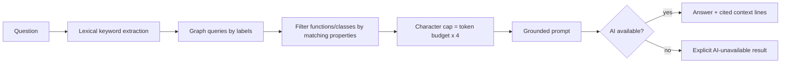

The main `QueryTool` currently uses lexical matching over graph properties. Embedding and cache
adapter packages exist, but the query path does not instantiate them. They are architectural
extension points rather than active dependencies in this flow.

### The `/jsat` skill dispatcher: input correction, learning, and the internet exception

Every shipped `commands/jsat-*.md` skill is routed through the single `/jsat <name> [flags]
[args]` dispatcher installed by `jsat connect <client>`. Three behaviors apply universally,
ahead of and after the routed subcommand itself:

- **Default input correction.** Before routing, the dispatcher treats free-form ARGS as likely
  rushed input and calls `jsat__prompt_rewrite` to fix spelling/grammar and tighten phrasing,
  skipping literal payloads (paths, diffs, URLs, code blocks) that must not be rewritten. A
  materially changed ARGS is routed but surfaced back to the user as `📝 Interpreted as:
  <rewritten>` so a bad guess stays visible and correctable. `raw=true` opts out for that one
  call.
- **Universal learning module.** After a routed subcommand completes, the dispatcher runs one
  more pass asking whether anything durable surfaced. Concrete, project-specific facts (a
  gotcha, a false-positive pattern, a convention discovered by exploration) are written to the
  project's own knowledge base via `jsat__knowledge_add(category="project-learning")`; facts
  about JSAT's own tools misbehaving are written instead to a `jsat-improvement` backlog that
  `/jsat improve` reads later. Nothing is written when the invocation was routine — this module
  is best-effort and silent in the common case.
- **`jsat-internet` — the one sanctioned exception.** No `jsat__*` MCP tool reaches the live
  internet, so every other skill is restricted to `jsat__*` tools only. `jsat-internet.md` is
  the deliberate carve-out: it calls native `WebSearch`/`WebFetch` directly for up-to-date facts
  (docs, released versions, CVEs), optionally grounding the external answer against this
  codebase via `jsat__query`. `jsat-magic.md` wires it in as an opt-in **Layer W** — never
  auto-selected for a pure-codebase task, added only when a task's own wording names external
  or current information, and dropped first if the composed skill sequence is over budget.

### Auto-generated help

`commands/jsat-help.md` used to be a hand-maintained document and had drifted stale — listing
commands that had since been deleted and omitting newly added ones. It is now generated by
`_generate_help_body()` in `_cli_skills_data.py` from the same live `commands/jsat-*.md` file
list that every other dispatcher artifact already reads, removing that one registry from the
"parallel hand-maintained registries" risk in §14 — the help body specifically can no longer
drift out of sync with the shipped command set, even though `_cli_skills_data.py` and the
command Markdown remain separate files overall.

## 6. Configuration, paths, and deployment profiles

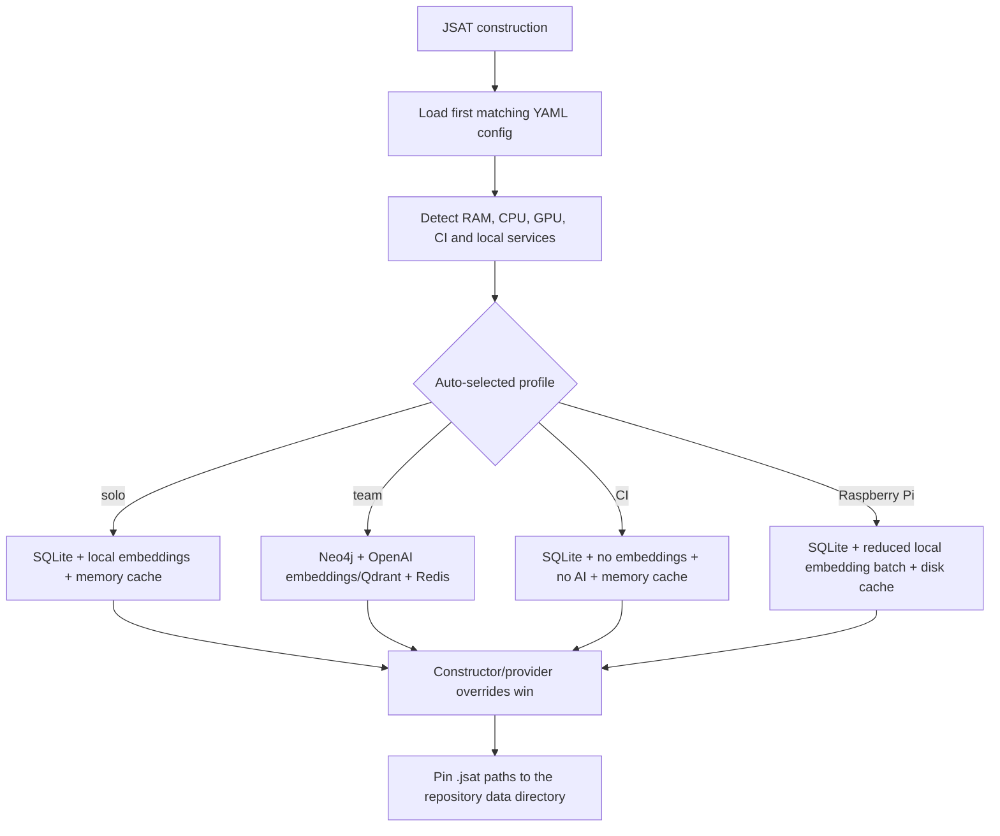

Config search starts with an explicit path and `JSAT_CONFIG`, then repository-local, global user,
and system paths. Per-repository data resolves in this order:

1. `JSAT_DATA_DIR` override.
2. Existing substantial `<repo>/.jsat/` data for backward compatibility.
3. `~/.jsat/<first-12-chars-of-SHA1(resolved-repo-path)>/`.

The graph database, vector path, disk cache, audit log, and prompt history are pinned under that
location. Session files are global under `~/.jsat/sessions/`. Self-improvement data is separately
global under `~/.jsat/improve/` so it can never be confused with user repository data.

## 7. AI provider selection and degradation

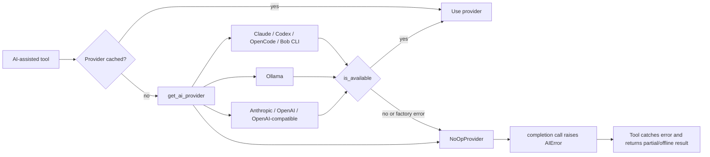

`JSAT._get_ai()` never propagates provider construction or reachability failures; it substitutes
`NoOpProvider`. That provider reports unavailable and raises on actual completion, so feature
tools must explicitly degrade. Query, review, Crack, and other multi-agent tools isolate failures
at the smallest practical unit.

## 8. Self-improvement privacy boundary

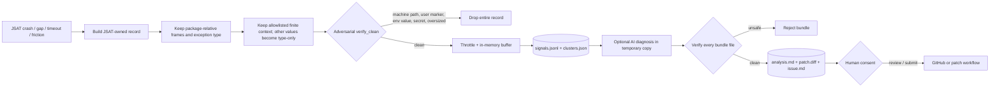

The design uses **drop, never redact**. Exception messages, user paths, identifiers, source code,
environment values, and secrets are not persisted. Writes go through a path guard that permits
only the improve store or an explicit temporary root. JSAT does not patch its installed source,
and outward actions remain human-controlled.

## 9. Integration and process lifecycle

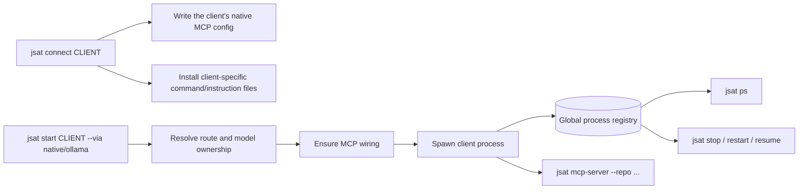

Connection code is client-specific because Claude, Codex, Cursor, Continue, OpenCode, Gemini,
Bob, Windsurf, and Zed use different configuration formats. The generated entry launches the
same local stdio MCP server. Slash-command files and MCP registration are separate surfaces: the
presence of one does not prove the other is active.

## 10. Extensibility map

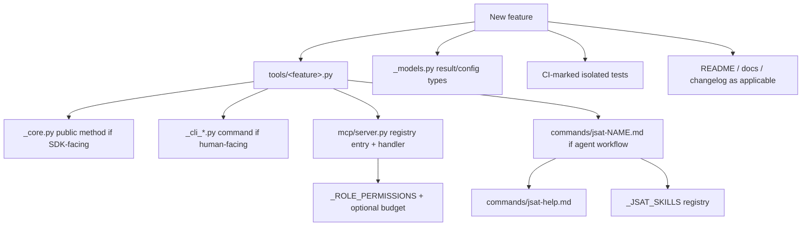

A capability is not fully integrated merely because its tool module exists. The public surfaces,
RBAC, agent command registries, documentation, and tests are independent integration points.

## 11. Resilience and observability

- `checkpoint()` records progress events without coupling feature modules to the MCP server.
- MCP can mirror checkpoints to standard progress notifications and the zero-dependency SSE
  dashboard.
- In-memory per-tool metrics track calls, total time, and errors; an optional Prometheus sidecar
  exports process metrics.
- Indexing catches failures per file; review and multi-agent features catch failures per provider
  or agent; telemetry is always best-effort and cannot fail the caller.
- SQLite and LightGraph use WAL mode and bulk writes. Neo4j implements the same `GraphClient`
  contract, although its bulk methods currently loop over individual operations.
- Export/import moves the graph through a portable archive. The default SQLite graph is local;
  the team profile moves the graph, vectors, and cache to shared services.

## 12. Testing architecture and current health

The test suite is organized by feature rather than by architectural layer. Tests use temporary
state directories, `MagicMock` for the SDK in MCP tests, and `LightGraph` or temporary SQLite for
graph-dependent behavior. CI selects tests marked `ci`; integration and slow tests are excluded
from the normal local/CI run.

The verified direct CI-safe pytest run produced **611 passed, 9 skipped, 34 deselected** and 35
deprecation warnings from `datetime.utcnow()` in the generated `INDEX.md` path. The combined
`local_test.sh` runner currently stops at an upstream 102-character line in
`tests/test_ollama_launch.py:236`, so its Ruff stage is not green at this snapshot.

## 13. Architectural strengths

1. **One graph, multiple adapters.** CLI, SDK, shell, and MCP do not maintain separate analysis
   engines.
2. **Useful offline core.** Indexing, traversal, token work, migration inspection, and much of
   security analysis do not require an LLM.
3. **Lazy optional dependencies.** Core startup stays light and deployment profiles can omit
   expensive integrations.
4. **Explicit degradation.** Missing providers and per-file/per-model failures normally yield
   partial results instead of process-wide crashes.
5. **Strong privacy boundary.** Self-improvement is structurally separated from indexed project
   data and uses a second adversarial verification pass.
6. **Operational MCP controls.** RBAC, nesting limits, progress, budgets, hard timeouts,
   dashboards, and metrics live at the common server boundary.

## 14. Risks and known debt

| Priority | Finding | Why it matters |
|---|---|---|
| High | `mcp/server.py` is 2,881 lines and `_handle` has measured complexity 52 | Registry, transport, auth, budgets, dashboards, metrics, and serialization change together |
| High | The MCP “hard timeout” is `Future.result(timeout=...)` over a worker thread; `shutdown(wait=False)` cannot terminate code already running | The client receives a timeout response, but the underlying operation may continue using resources or mutating state |
| High | `_cli_skills_data.py` and command Markdown are parallel hand-maintained registries | A new or renamed slash command can silently diverge across clients |
| High | `JSAT.index_status` returns `commit=None` and `is_fresh=True` whenever graph access works | Health reports graph availability, not actual Git/index freshness |
| Medium | `GraphConfig` accepts `lightgraph`, but `JSAT._get_graph()` selects Neo4j or `SQLiteGraph`; it never constructs `LightGraph` | The advertised configuration value does not select its named backend through the SDK facade |
| Medium | Embedding and cache backends are implemented but not wired into the main query flow | Config implies semantic retrieval/caching that `QueryTool` currently does not use |
| Medium | Neo4j `bulk_add_nodes` and `bulk_add_edges` loop item-by-item; symbol resolution is skipped for non-SQLite backends | Team indexing can be slower and may preserve unresolved call/import targets |
| Medium | YAML skill clusters reference skills that may not exist; non-script dispatch mostly returns instructions | This registry is secondary to shipped command Markdown and is only partially executable |
| Medium | Current docs still contain 0.4.12 examples while package metadata is 0.4.14 | Operators can mistake documentation snapshots for runtime truth |
| Low | The local test doctor reports two stale/shadowing installations | Console-script behavior may differ by environment even while source-root tests are green |
| Low | Generated index timestamps call deprecated `datetime.utcnow()` | Python deprecation warnings add noise and will eventually require a code change |

The largest cohesion hotspots after `mcp/server.py` are `_cli_skills_data.py` (1,694 lines),
`_cli_connect.py` (1,291), `tools/shell.py` (1,188), and `tools/prompt_optimizer.py` (902).
Measured function hotspots include `cmd_disconnect` (complexity 61), `MCPServer._handle` (52),
and `cmd_ai_use` (36).

## 15. Recommended evolution

1. Split MCP transport/auth/execution/observability from the declarative tool catalogue and
   feature handlers; generate tool schemas and RBAC checks from one typed definition.
2. Generate client command assets and help tables from one command manifest, eliminating the two
   manually synchronized registries.
3. Make index freshness compare the manifest commit and working tree against current Git state,
   and expose separate `graph_available` and `index_fresh` signals.
4. Either route `lightgraph` correctly from `_get_graph()` or remove it from user configuration
   and document it as a test-only constructor.
5. Introduce explicit retriever and cache ports into `QueryTool`, then wire the existing embedder
   and cache packages or simplify the unused configuration surface.
6. Batch Neo4j writes with `UNWIND` and define a backend-neutral symbol-resolution strategy.
7. Keep architectural snapshot counts generated by tests or documentation checks so version,
   command, and tool counts cannot drift silently.

## 16. Reading order for contributors

For the fastest accurate mental model, read in this order:

1. `jsat/_core.py` — public facade and lazy dependency selection.
2. `jsat/tools/indexer.py` and `jsat/_parsers/` — how source becomes graph data.
3. `jsat/_graph/__init__.py` and `jsat/_graph/sqlite.py` — graph contract and default storage.
4. `jsat/tools/query.py` and `jsat/tools/blast_radius.py` — representative read workflows.
5. `jsat/mcp/server.py` lines around `_handle`, `_call`, and `_build_registry` — shared AI-client
   execution boundary.
6. `jsat/_config.py`, `_models.py`, and `_ai/` — deployment and provider behavior.
7. `jsat/_improve/` — the privacy and safe-write invariants.
8. Feature-specific modules under `jsat/tools/`, followed by their tests.
